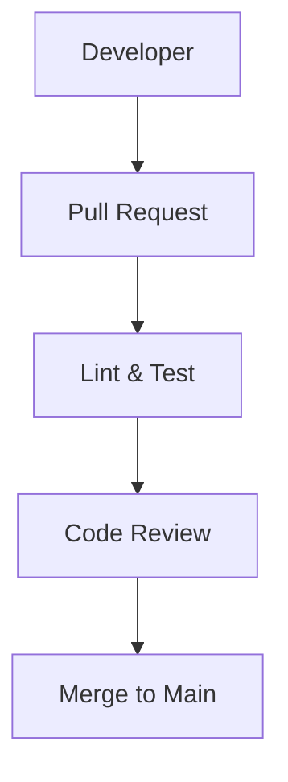

- 👋 Hi, I’m @Synapsia-Solutions
- 👀 I’m interested in ...
- 🌱 I’m currently learning ...
- 💞️ I’m looking to collaborate on ...
- 📫 How to reach me ...
- 😄 Pronouns: ...
- ⚡ Fun fact: ...

<!---
Synapsia-Solutions/Synapsia-Solutions is a ✨ special ✨ repository because its `README.md` (this file) appears on your GitHub profile.
You can click the Preview link to take a look at your changes.
--->
# 👨‍💻 Engineering Handbook

This repository contains the core development standards, PR guidelines, and architectural workflow diagrams for the Synapsia team.

## 📐 Coding Standards

- Follow `.editorconfig` for formatting
- PRs must include a checklist (see below)
- Linting rules enforced via GitHub Actions

## 📊 Workflow Diagram

## ✅ PR Checklist

- [ ] Code adheres to formatting rules
- [ ] Unit/integration tests pass
- [ ] Mermaid diagram updated (if applicable)
